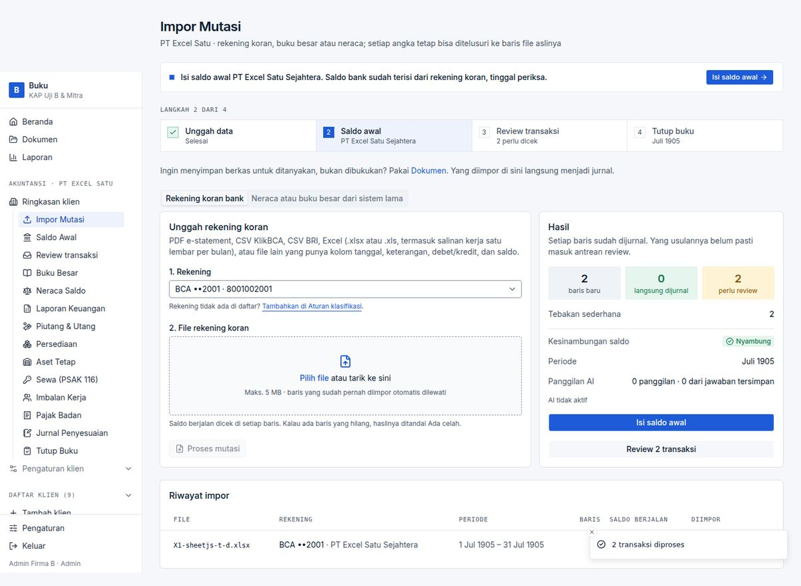
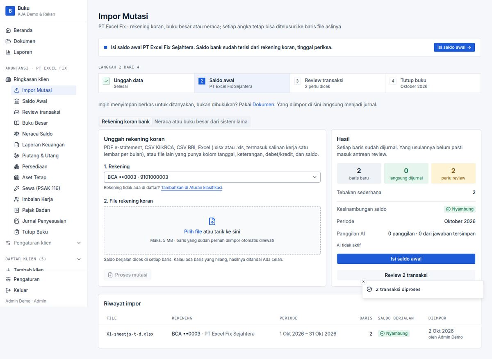

# BUG-002 — XLSX with ISO date cells (`t="d"`) is imported with dates in 1905 and reports success

| | |
|---|---|
| **Severity** | High |
| **Status** | **Fixed** (branch `task/fix-qa-bugs`) |
| **Area** | Impor Mutasi (XLSX) |
| **Test cases** | E12 (fails) · E12b (standard Excel dates pass) |

## Steps to reproduce
1. Create an .xlsx with SheetJS using `cellDates: true` (many web exporters do) so date cells are stored as `<c t="d"><v>2026-10-02T00:00:00.000Z</v></c>`.
2. Upload it for a bank account, columns Tanggal / Keterangan / Debet / Kredit / Saldo.

## Expected
Rows dated 2 Oct and 5 Oct 2026.

## Actual
Both rows are stored as **1905-07-18** and the toast says *“2 transaksi diproses”*. (A file created by desktop Excel/ExcelJS, which stores serial numbers with a date style, imports correctly.)

## Root cause
ExcelJS parses the ISO string as the number 2026 → Excel serial 2026 = 18 Jul 1905. `asXlsx()` (`lib/import/workbook.ts`) only normalises XLS/markup, not XLSX, and `cellText` has no plausibility check on the resulting date.

## Impact
Silent mis-dating: the statement lands in a 1905 period, wrong period/lock behaviour, wrong Saldo Awal and reports, with a success message. On a client's first import nothing cross-checks it.

## Suggested fix (original)
Run XLSX through the existing SheetJS normaliser too (it converts `t="d"` to serials), and/or reject statement dates outside a sane window (e.g. before 2000 or more than a year ahead) with a message naming the row. Add a unit test with a `t="d"` workbook.

## Evidence

## Fix applied

`readableXlsx()` (`lib/import/workbook.ts`) detects `t="d"` date cells and rewrites such a workbook through SheetJS before ExcelJS reads it; used by the statement and ledger importers. The import pipeline also refuses any statement date before 2000 or after 2100 with the row number (second line of defence).

**Regression guard:** `tests/unit/import-qa.test.ts` (ISO-date workbook, ordinary Excel date), `tests/db/import-twin-rows.test.ts` (implausible date).

**Re-verified in the browser:** case `VF-002` in [results-table.md](../results-table.md).

