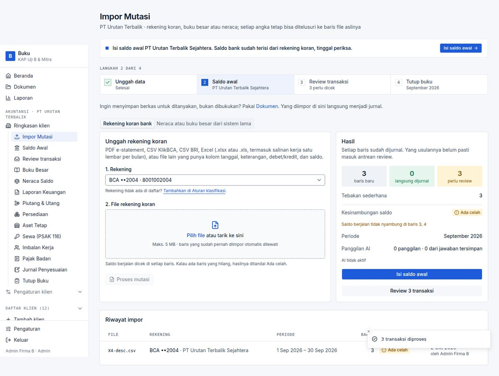
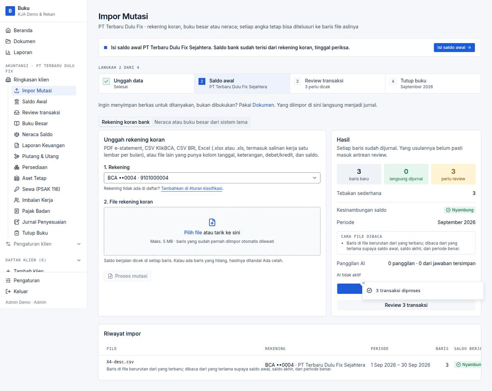
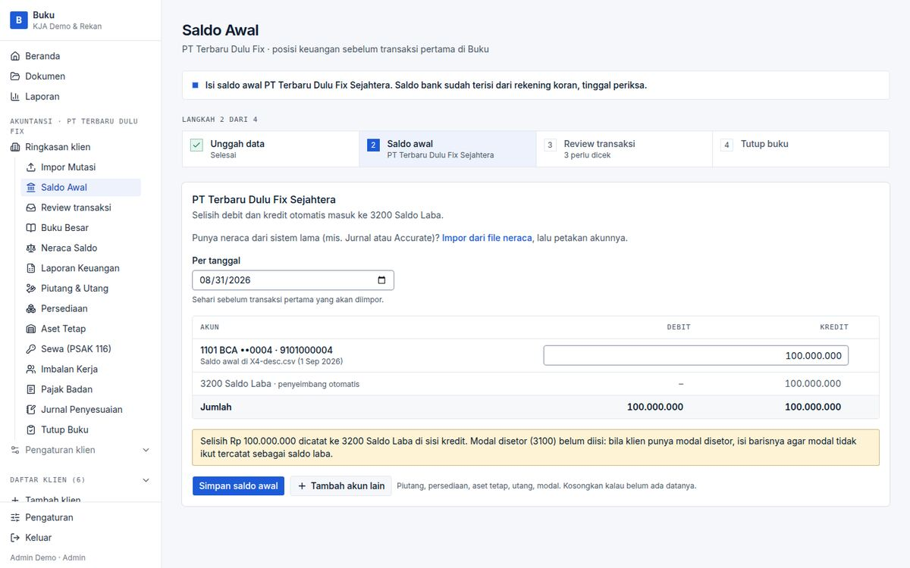

# BUG-004 — Newest-first statement exports are read with the wrong opening/closing balance and period

| | |
|---|---|
| **Severity** | Medium |
| **Status** | **Fixed** (branch `task/fix-qa-bugs`) |
| **Area** | Impor Mutasi |
| **Test cases** | E15 · E15b |

## Steps to reproduce
1. Upload a generic CSV whose rows run newest → oldest (20/09, 10/09, 05/09) with a Saldo column (true opening Rp 100.000.000, closing Rp 103.500.000).

## Expected
Rows re-sorted; opening 100.000.000, closing 103.500.000, continuity OK.

## Actual
Stored opening = 100.500.000, closing = 101.000.000, continuity *Ada celah*. *Saldo Awal* is then prefilled from the wrong opening (Rp 100.500.000). The user is warned by *Ada celah*, but the derived figures are wrong.

## Root cause
No re-ordering: opening is derived from the first printed row (`openingFromBalances`) and closing from the last (`common.ts`, `tabular.ts`).

## Impact
Internet-banking exports are frequently newest-first. A wrong prefilled opening balance flows into the books' first journal.

## Suggested fix (original)
Detect a monotonic descending date order and reverse the rows (stable, preserving the original row number for traceability) before deriving opening/closing; keep a note “urutan dibalik”.

## Evidence

## Fix applied

`parseTabular` reverses a table whose dates (all with printed years) run strictly newest → oldest, keeping each row's original row number, and adds a note. A few rows out of order, year-less dates and oldest-first files are untouched.

**Regression guard:** `tests/unit/import-qa.test.ts` (3 cases).

**Re-verified in the browser:** case `VF-004 / VF-004b` in [results-table.md](../results-table.md).

