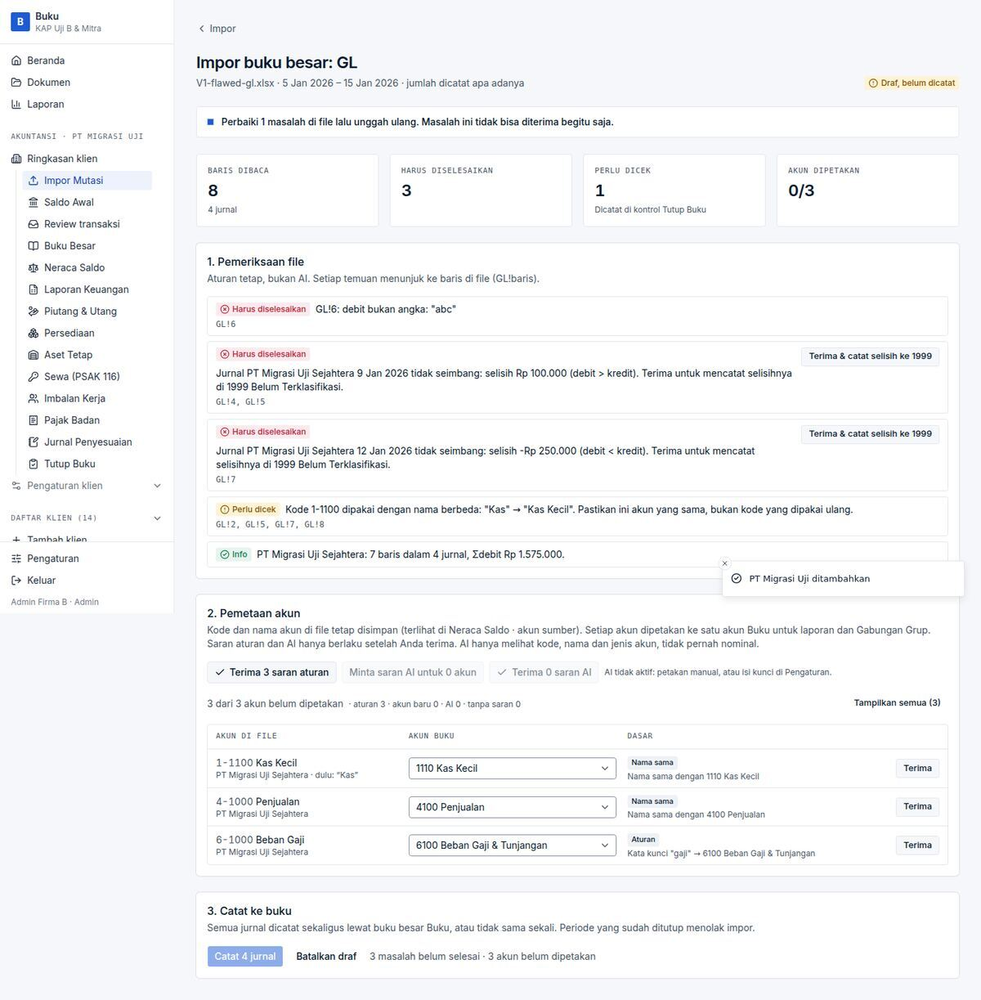

# BUG-006 — Indonesian-format text rate `15.750,50` in a ledger file is read as 15.7505

| | |
|---|---|
| **Severity** | Medium |
| **Status** | Open |
| **Area** | Impor Buku Besar / Neraca |
| **Test cases** | V3 (code-level probe) |

## Steps to reproduce
1. Create a GL .xlsx with a USD line whose *Kurs* cell is the **text** `15.750,50`.
2. Read it with `readLedger` (or upload on *Impor → Neraca atau buku besar*).

## Expected
Rate 15750.50.

## Actual
`rate: '15.75050'`, `errors: []` — no row error.

## Root cause
`lib/ledger-import/read.ts:302`: `rateText.replace(/,/g, "")` removes the decimal comma and keeps the thousands dot.

## Impact
Foreign-currency lines from Accurate/Jurnal exports with text rates are converted at a rate ~1,000× too small; only a later control against the Kurs table might notice.

## Suggested fix
Reuse `normalizeRateInput`-style detection (last separator is the decimal) for text rates, and report a row error when the rate is outside a plausible range for the currency.

## Evidence

