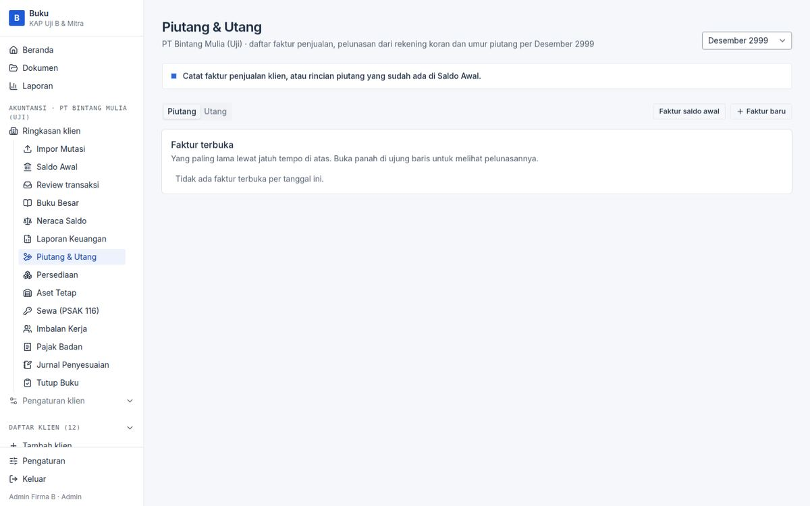
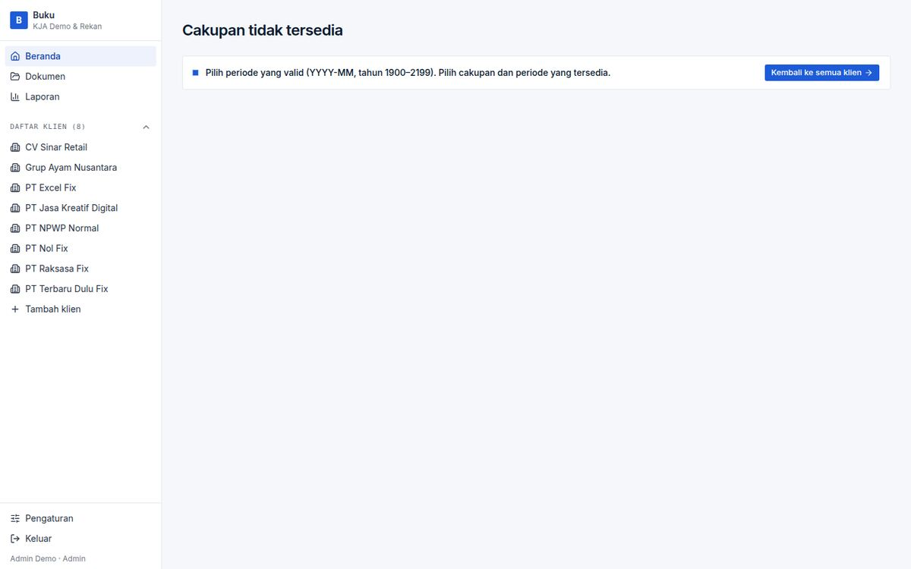

# BUG-007 — `?period=2026-13` or `2026-00` renders “undefined 2026” and exports `…-undefined-2026.xlsx`

| | |
|---|---|
| **Severity** | Medium |
| **Status** | **Fixed** (branch `task/fix-qa-bugs`) |
| **Area** | URL parameters / exports |
| **Test cases** | K9 · X5b |

## Steps to reproduce
1. Open `/clients/<id>/reports?period=2026-13` (also `/`, `/trial-balance`, `/close`, `/tax`…).
2. Or GET `/clients/<id>/reports/export?entity=<id>&period=2026-13`.

## Expected
Fallback to the default period or a validation message (the home page already says “Pilih periode yang valid”).

## Actual
HTTP 200 with the label “undefined 2026” and an Excel named `laporan-keuangan-CV_Sinar_Retail-undefined-2026.xlsx`.

## Root cause
`lib/scope.ts:6-10` `parsePeriod` accepts any `\d{2}` month with no 1–12 range check.

## Impact
Cosmetic for pages; for exports a mislabelled file. Also lets junk `Period` rows be created by actions that take a year/month.

## Suggested fix (original)
Validate `1 ≤ month ≤ 12` (and a year window) in `parsePeriod` and fall back to the default, mirroring `lib/workspace/index.ts`.

## Evidence

## Fix applied

`parsePeriod` (`lib/scope.ts`) accepts months 1–12 and years 1900–2199, otherwise the default period (pages, both export routes).

**Regression guard:** `tests/unit/qa-validation.test.ts`.

**Re-verified in the browser:** case `VF-007` in [results-table.md](../results-table.md).

