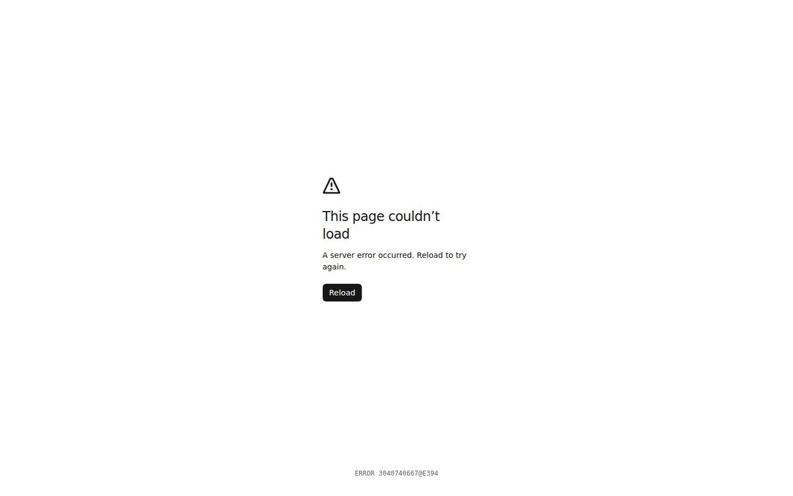
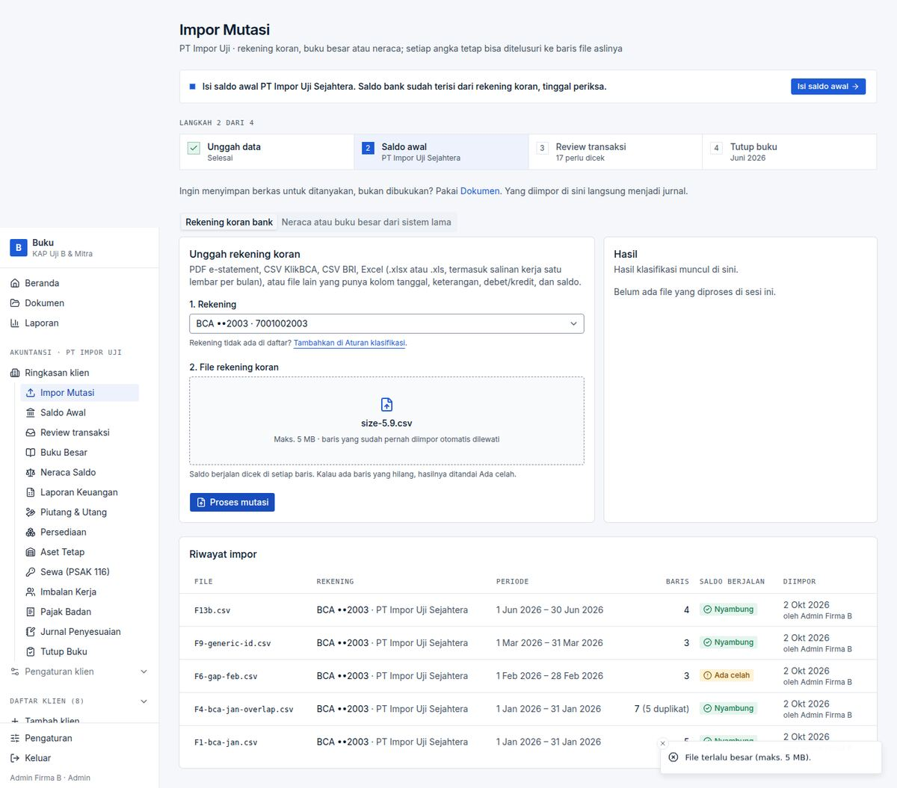
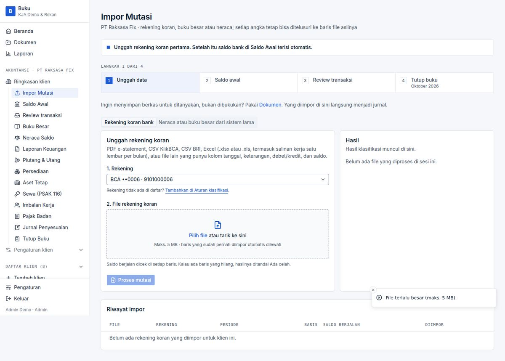

# BUG-008 — Uploading a file above 6 MB replaces the whole page with an English generic error

| | |
|---|---|
| **Severity** | Medium |
| **Status** | **Fixed** (branch `task/fix-qa-bugs`) |
| **Area** | Impor Mutasi |
| **Test cases** | E08 (7.6 MB) · E08-5.5 / E08-5.9 (friendly)  |

## Steps to reproduce
1. On *Impor Mutasi* choose a 7.6 MB CSV and click *Proses mutasi*.

## Expected
*“File terlalu besar (maks. 5 MB).”* like files between 5 and 6 MB.

## Actual
HTTP 413 `Body exceeded 6mb limit`; the page becomes “This page couldn’t load — A server error occurred. Reload to try again.” (English, loses the form).

## Root cause
`next.config.ts` allows 6 MB request bodies while the action checks 5 MB (`app/actions.ts:70`); beyond 6 MB Next rejects before the action runs. The form has no client-side size check.

## Impact
UX break for a plausible mistake (a multi-month PDF).

## Suggested fix (original)
Check `file.size` in `ImportForm` (and the ledger/evidence forms) before submit, with the same Indonesian message.

## Evidence

## Fix applied

`ImportForm` and `LedgerImportForm` check `file.size` against `MAX_UPLOAD_BYTES` (`lib/upload.ts`, also used by the server actions) when the file is chosen or dropped, show *“File terlalu besar (maks. 5 MB).”* and clear the input — the request is never sent.

**Regression guard:** Browser (`VF-008`): a 6.5 MB file now gives the friendly toast and the page stays.

**Re-verified in the browser:** case `VF-008` in [results-table.md](../results-table.md).

