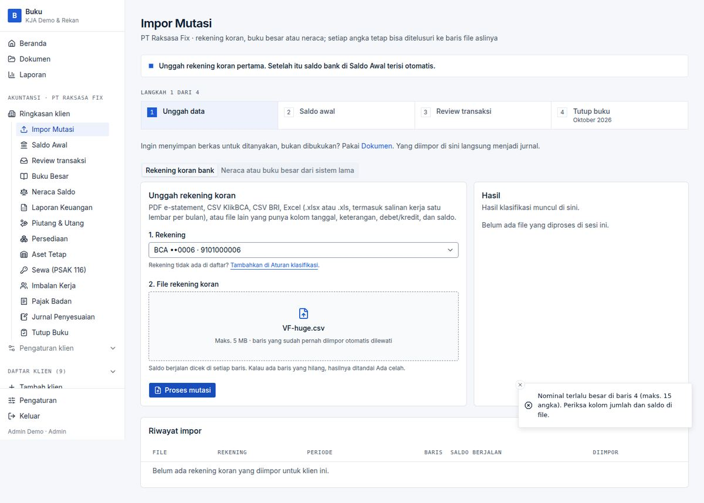
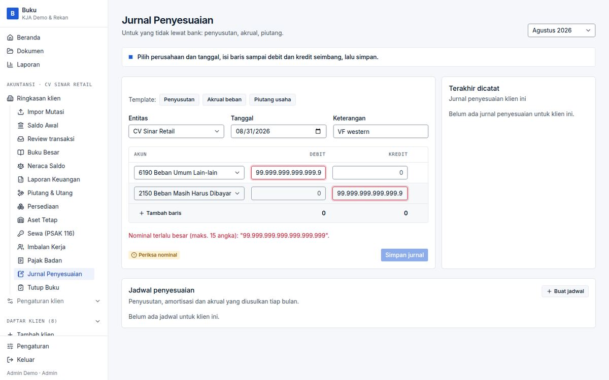

# BUG-010 — Out-of-range amounts end in “Terjadi kesalahan tak terduga”

| | |
|---|---|
| **Severity** | Low |
| **Status** | **Fixed** (branch `task/fix-qa-bugs`) |
| **Area** | Impor Mutasi · Jurnal Penyesuaian |
| **Test cases** | E18 · K7 |

## Steps to reproduce
1. Import a row with a 20-digit credit, or enter `99.999.999.999.999.999.999` in a journal line and save.

## Expected
A clear “nominal terlalu besar” message.

## Actual
Prisma `value out of range for type bigint` in the log; the user sees the generic unexpected-error toast.

## Root cause
No upper bound on amounts before the database (`postJournal` does not validate it either).

## Impact
Low (typo case), but the message hides the cause.

## Suggested fix (original)
Validate against a maximum (e.g. 9.2e18 or a business limit) in `parseMoney`/`parseRupiah` and the parsers.

## Evidence

## Fix applied

`parseMoney` refuses more than 15 integer digits with *“Nominal terlalu besar”* (journal, Saldo Awal, faktur…); the import pipeline refuses statement amounts/balances beyond 10^15 with the row number. The shared file parsers stay uncapped on purpose: the evidence extractor reads source-reported figures of any size.

**Regression guard:** `tests/unit/amount-input.test.ts`, `tests/db/import-twin-rows.test.ts`.

**Re-verified in the browser:** case `VF-010a / VF-010b` in [results-table.md](../results-table.md).

