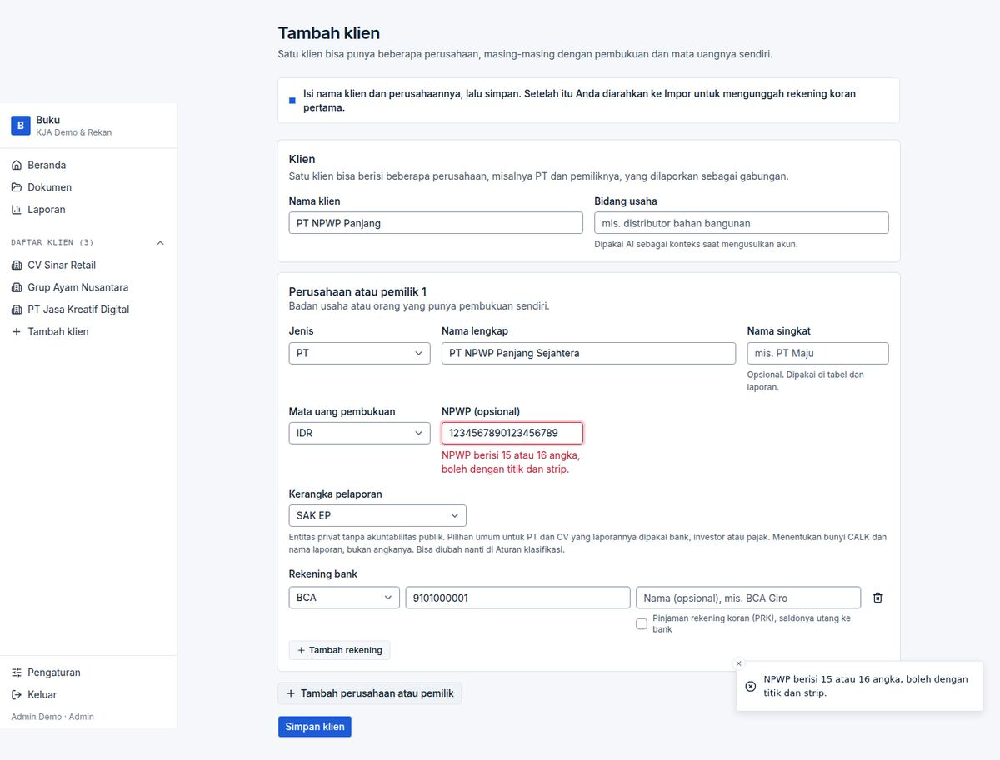

# BUG-011 — NPWP validation accepts 19–25 digits and stores the value un-normalised

| | |
|---|---|
| **Severity** | Low |
| **Status** | **Fixed** (branch `task/fix-qa-bugs`) |
| **Area** | Tambah klien / Pengaturan |
| **Test cases** | C04a–e |

## Steps to reproduce
1. Tambah klien with NPWP `1234567890123456789` (19 digits).

## Expected
Rejected, as the field message says *“NPWP berisi 15 atau 16 angka”*.

## Actual
Saved exactly as typed.

## Root cause
`lib/onboarding.ts:51`: `/^[\d.\-\s]{15,25}$/` counts separators as well as digits.

## Impact
Dirty tax-ID data in the tax pack / reports headers.

## Suggested fix (original)
Strip separators, require exactly 15 or 16 digits, store normalised (or in the `99.999.999.9-999.999` format).

## Evidence

## Fix applied

`normalizeNpwp` (`lib/onboarding.ts`) requires exactly 15 or 16 digits (separators allowed), stores 15-digit numbers as `99.999.999.9-999.999` and 16-digit numbers as typed.

**Regression guard:** `tests/unit/qa-validation.test.ts`.

**Re-verified in the browser:** case `VF-011a / VF-011b` in [results-table.md](../results-table.md).

