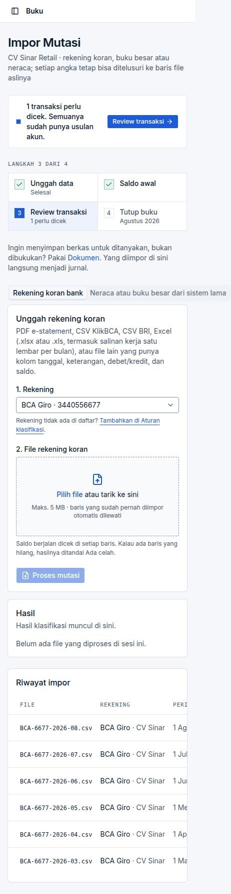
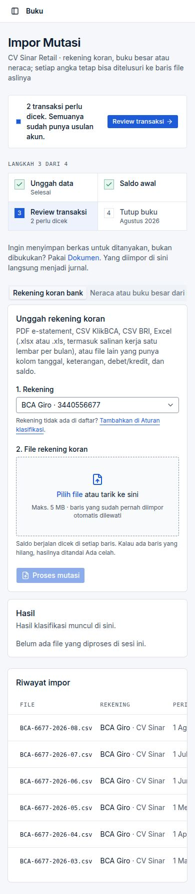

# BUG-012 — Impor Mutasi overflows horizontally at 390 px; the history table is clipped

| | |
|---|---|
| **Severity** | Low |
| **Status** | **Fixed** (branch `task/fix-qa-bugs`) |
| **Area** | Layout (mobile) |
| **Test cases** | Y1 |

## Steps to reproduce
1. Open `/clients/<id>/import` at 390 px width.

## Expected
No horizontal page scroll; table scrolls inside its card.

## Actual
Document is 462 px wide; the tab *“Neraca atau buku besar dari sistem lama”* runs off-screen and the *Riwayat impor* columns are cut off.

## Root cause
Tab strip without wrapping / table without an `overflow-x-auto` wrapper.

## Impact
Cosmetic on phones (all 19 other pages tested were fine).

## Suggested fix (original)
Wrap the tabs and the table.

## Evidence

## Fix applied

The *Rekening koran / Neraca atau buku besar* tab strip on Impor Mutasi is `max-w-full overflow-x-auto`, so it scrolls inside the page. (The history tables were already inside a scrolling container.)

**Regression guard:** Browser (`VF-012`): 390 px page width = viewport.

**Re-verified in the browser:** case `VF-012` in [results-table.md](../results-table.md).

