# QA report — Buku end-to-end, Indonesian accounting

**Date:** 2 Oct 2026 · **Target:** `ismailir10/native-erp-v2` @ `main` (99d9351) · **Plan:** [test-plan.md](./test-plan.md) · **Per-case results:** [results-table.md](./results-table.md) · **Bugs:** [bugs/README.md](./bugs/README.md)

## 1. Verdict

**The accounting core is sound; the input edges are not yet.** Every figure I recomputed independently (trial balances, Laba Rugi, Neraca, PPN, PPh 23, Pasal 31E, PP 55/2022, lease PV, aging, ledger balances) matched to the rupiah, and tenant isolation, role gating and period locks held. The defects cluster where numbers and files *enter* the system: a few input formats silently produce wrong amounts or dates.

| | |
|---|---|
| Checks recorded | **165** — ✅ 132 pass · ❌ 14 fail · ℹ️ 18 observations · ⏭ 1 skipped |
| Pages crawled | 61 (every route × every client) — 0 server errors, 0 console errors, 0 `NaN/undefined/null` |
| Blockers found | **1 — fixed in this branch** ([BUG-001](./bugs/BUG-001.md)) |
| Open bugs (separate list) | **13** — 2 High, 5 Medium, 6 Low |
| Repo gates (before → after fix) | lint ✅ · typecheck ✅ · Vitest 862 → **868** ✅ · `verify:books` ALL PASS (1,741) ✅ · Playwright e2e **28/28** ✅ both times |

**Top three things to fix next (all silent-wrong-number risks):**
1. [BUG-003](./bugs/BUG-003.md) — typing `250,000` books **Rp 250** (journals, Saldo Awal, faktur, aset…).
2. [BUG-002](./bugs/BUG-002.md) — an XLSX with ISO date cells imports with dates in **1905** and says "success".
3. [BUG-004](./bugs/BUG-004.md) / [BUG-005](./bugs/BUG-005.md) / [BUG-006](./bugs/BUG-006.md) — newest-first statements give a wrong opening balance; cross-rates and text rates can be 1,000× off.

## 2. What was tested and how

Real browser (Playwright/Chromium, `id-ID`, WIB) against the built app and a local Postgres with the synthetic firm *KJA Demo & Rekan* (CV Sinar Retail, Grup Ayam Nusantara with PT + owner, PT Jasa Kreatif Digital) plus extra firms/clients created for tenant, onboarding, import, FX and ledger-migration tests. **Expected values were computed outside the app** (SQL over raw `JournalLine`, exact BigInt/rational arithmetic), not read back from the app. Full plan: [test-plan.md](./test-plan.md).

**Environment limits (be aware):** the sandbox blocked `*.supabase.co`, so login ran against a local GoTrue stand-in (real invite/reset e-mails and token refresh are *not* covered); `xlsx` came from the npm mirror of the same 0.20.3 release; no AI key (rules-only mode); Chromium only. See §7.

## 3. What worked (with evidence)

### Reports reconcile to the ledger
Trial balance recomputed from raw journal lines for 3 clients / 4 entities (8 trial balances): every opening, movement and closing figure identical, ΣDebit = ΣKredit each time (cases `I-TB-*`). Laba Rugi month + YTD and Neraca (A = L + E) agree (`I-PL-CV`, `I-BS-CV`).

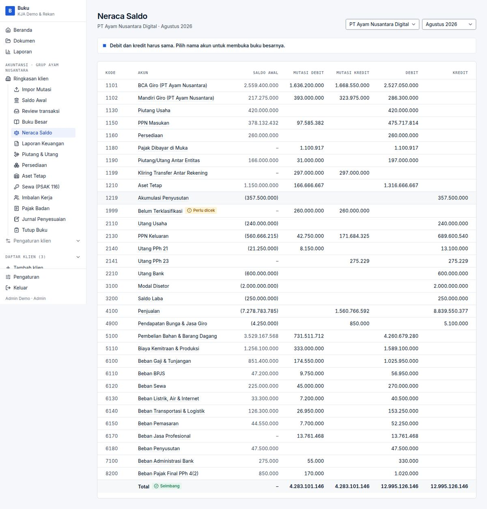

### PPN 11% effective and PPh 23 gross-up are exact (G1–G5)
Bank lines accepted through the Review screen produced the expected journals:

| Scenario | Expected (independent) | Posted |
|---|---|---|
| Mesin Rp 185.000.000 incl. PPN → 1210 + PPN Masukan | DPP 166.666.667 / PPN 18.333.333 | identical |
| Jasa konsultan, net Rp 15.000.000, PPN 11 % + PPh 23 2 % | DPP ≈ 13.761.468 / PPN ≈ 1.513.761 / PPh ≈ 275.229; DPP + PPN − PPh = net | 13.761.468 / 1.513.761 / 275.229 (2141) |
| DP penjualan net Rp 60.000.000 after customer's PPh 23 | DPP ≈ 55.045.872 / PPN 6.055.046 / PPh 1.100.917 → **1180** | 55.045.871 / 6.055.046 / 1.100.917 |

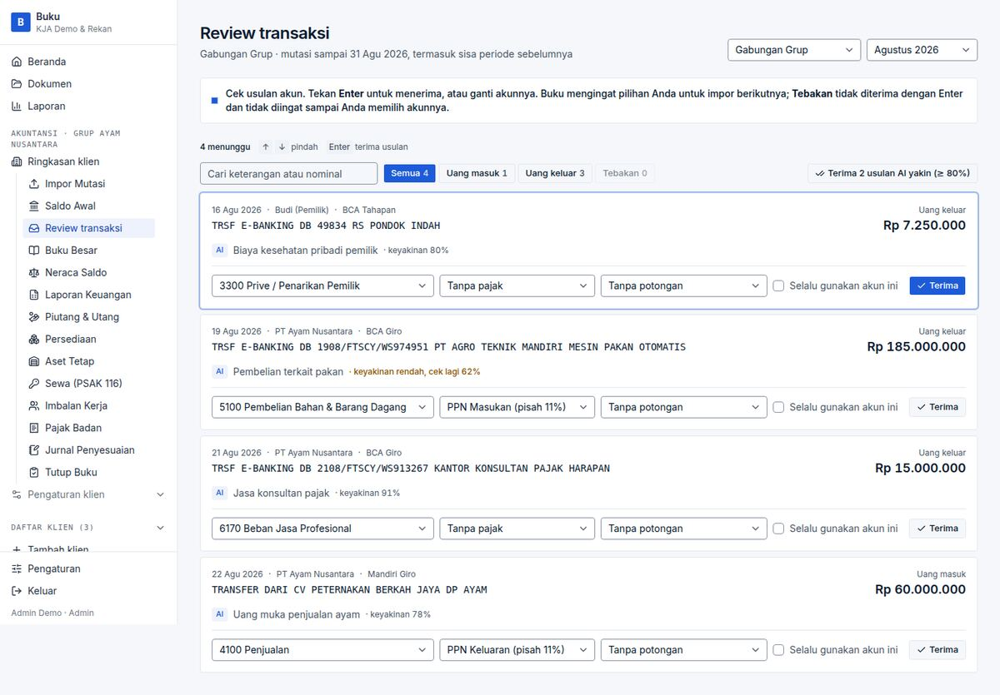

### Pajak badan (PPh 29) is arithmetically right
| Case | Check | Result |
|---|---|---|
| CV Sinar, turnover Rp 1,47 M | Pasal 31E full: PKP (rounded down to 000) × 22 % × 50 % | ✅ 35.364.670 |
| PT Ayam, turnover Rp 8,84 M | Partial 31E: PKP × 4,8 M ÷ turnover at 11 %, rest at 22 % | ✅ 78.832.438 + 132.686.502 = 211.518.940 |
| CV Sinar switched to PP 55/2022 | 0,5 % × turnover, floored | ✅ 7.347.437; app also states the Rp 4,8 M and 3/4/7-year limits it does *not* judge |
| Fiscal depreciation, new laptop Rp 12 M (Kelompok 1, Aug) | 25 % × 1/12 = 250.000; DTL 22 % = 55.000 | ✅ |

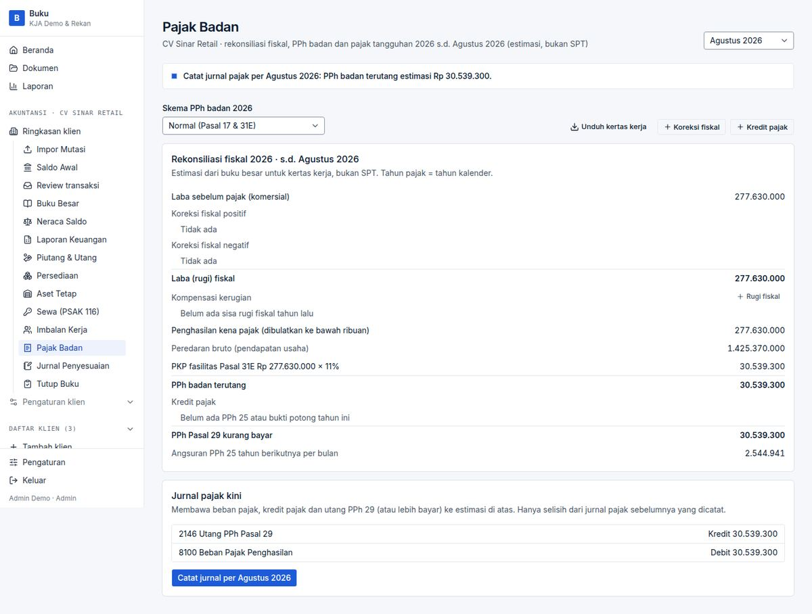

### Leases (PSAK 116), receivables aging (PSAK 109), inventory
- 24 × Rp 5.000.000 monthly in arrears at 12 % → PV **Rp 106.216.936** = independent exact-rational PV; liability after first payment 102.279.106; current/non-current split shown (`L1`).
- Invoices: PPN prefill 11 % incl. rounding (1.234.567 → 135.802), PPh 23 on invoice, duplicate number, due < issue, locked-month refusal, **aging buckets sum to the 1130 ledger**, settlement from a bank line (`M1–M10`).
- Stock opname Rp 100.000.000 vs book 95.000.000 → Dr 1160 / Cr 5190 5.000.000; HPP falls to 153.600.000 (`P1–P2`).

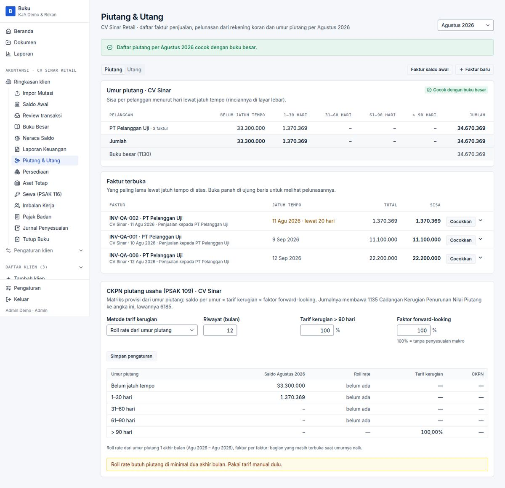

### Close, lock and reopen
Lock stays disabled until review is empty, due instalments are posted, REVIEW controls carry a note (4 chars refused, 5 accepted) and all three sign-offs are ticked; lock then records who/when; posting a journal, importing a statement or booking an invoice in a locked month is refused with a clear message; AKUNTAN cannot reopen; ADMIN needs a reason (≥ 5 chars), the reopening is logged and sign-offs are cleared; months reopen only in reverse order (`J1–J8, LK1–LK2, U1–U3, UO1`).

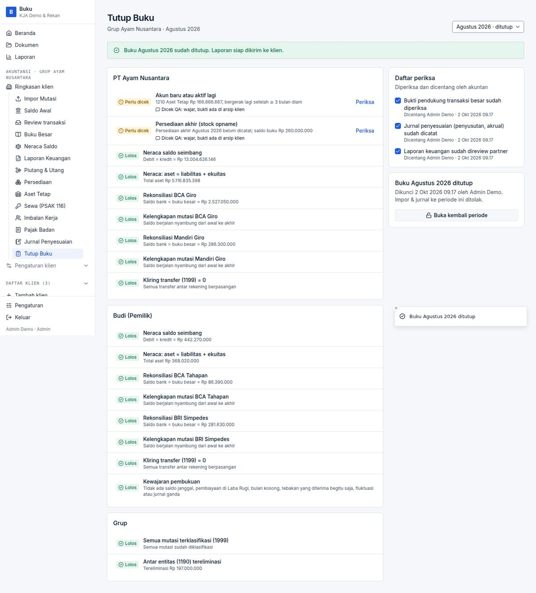

### Security and tenancy
Firm B could not reach firm A by any of 17 client routes, both Excel exports, and a forged `scope=client:<id>` (all 404 / "Cakupan tidak tersedia"; a forged evidence-intake id was not tested — none was seeded); unauthenticated requests redirect to login; login error is identical for unknown vs wrong credentials; password-reset notice identical for members/non-members; a revoked member is bounced on the next request; XSS payloads in login, client names, bank descriptions and Tanya Buku stay inert; AI key is stored encrypted (`A12*`, `A04–A06`, `A14`, `C08`, `E13`, `R3`, `S2`).

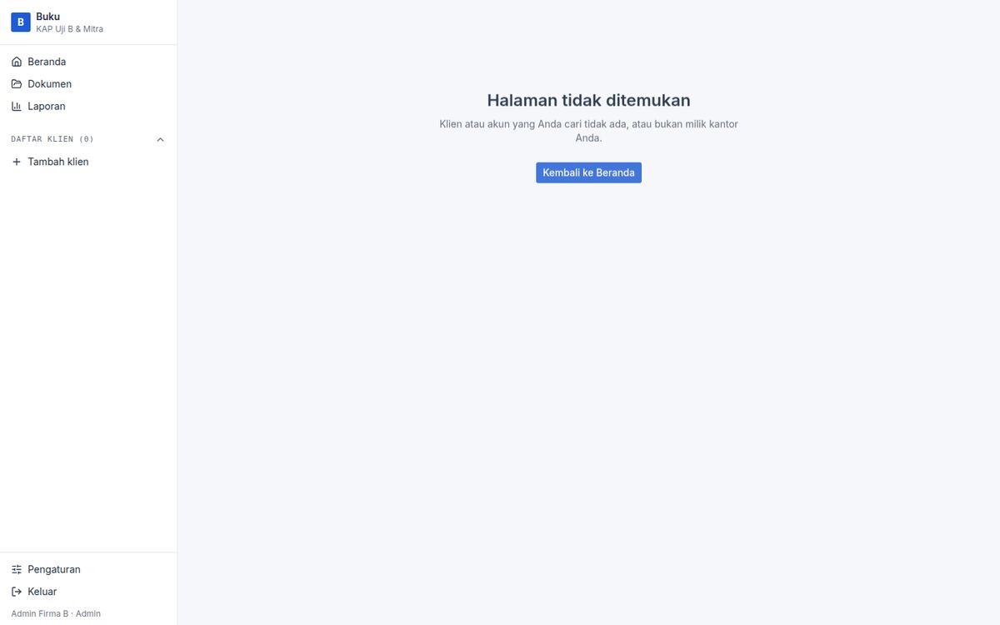

### Imports that behaved
Identical same-day rows *with* a balance column both kept; re-upload adds nothing; overlapping file adds only new rows; wrong account refused with one-click switch to the right one; broken running balance flagged *Ada celah*; empty/binary/header-only files refused politely; Indonesian `1.234.567,00` parsed correctly; flawed ledger file (unbalanced group, non-numeric cell, reused code) flagged with sheet!row refs and nothing posted (`E01–E07, E09, E13, V1–V2`).

## 4. Blocker found and fixed — BUG-001

*Bank import fails outright for identical same-day lines when the statement has no running-balance column* (two Rp 15.000 fees, repeated QRIS settlements…). The user sees only "Terjadi kesalahan tak terduga" and the whole month is blocked. Root cause: the row hash omitted anything distinguishing identical rows, and `(bankAccountId, hash)` is unique.

**Fix** (`lib/import/normalize.ts`, `lib/import/pipeline.ts`): the nth identical row in a file gets an ordinal-suffixed hash; the first keeps its plain hash, so existing data and re-upload dedupe are unchanged. **Tests:** `tests/db/import-twin-rows.test.ts` (3, all failed before with the production error, pass after) and `tests/unit/row-hashes.test.ts` (3). Re-verified in the browser:

| Before | After |
|---|---|
| 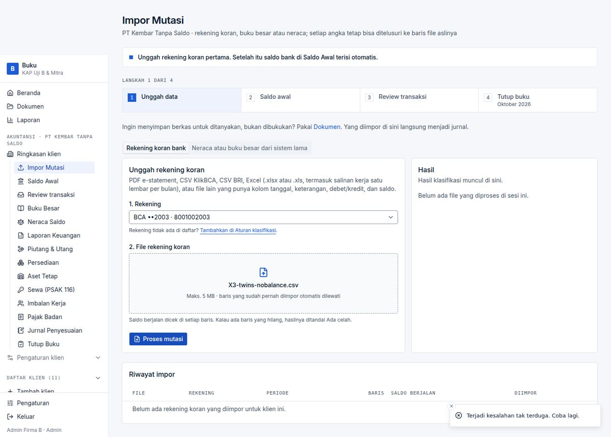 | 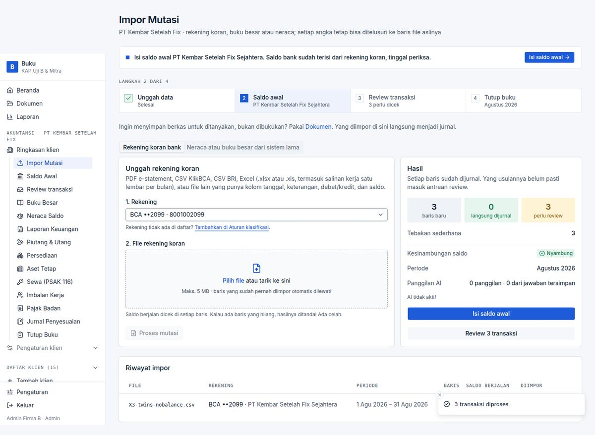 |

Gates after the fix: lint ✅ typecheck ✅ Vitest 868/868 ✅ `verify:books` ALL PASS ✅ e2e 28/28 ✅.

## 5. Open bugs (not fixed — separate list)

| ID | Sev | Title | Evidence |
|---|---|---|---|
| [BUG-002](./bugs/BUG-002.md) | High | XLSX ISO date cells → dates in 1905, "success" toast |  |
| [BUG-003](./bugs/BUG-003.md) | High | `250,000` read as Rp 250 (all typed amounts) |  |
| [BUG-004](./bugs/BUG-004.md) | Medium | Newest-first exports: wrong opening/closing → wrong Saldo Awal prefill |  |
| [BUG-005](./bugs/BUG-005.md) | Medium | Cross-rate `0.745` stored as 745 | 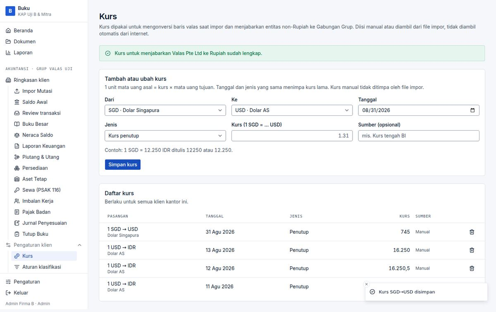 |
| [BUG-006](./bugs/BUG-006.md) | Medium | Ledger-file text rate `15.750,50` read as 15.7505 | code-level probe |
| [BUG-007](./bugs/BUG-007.md) | Medium | `?period=2026-13` → "undefined 2026" (pages and Excel file name) |  |
| [BUG-008](./bugs/BUG-008.md) | Medium | Upload > 6 MB replaces the page with an English error |  |
| [BUG-009](./bugs/BUG-009.md) | Low | One zero-amount row fails the whole import ("Jurnal minimal dua baris") | 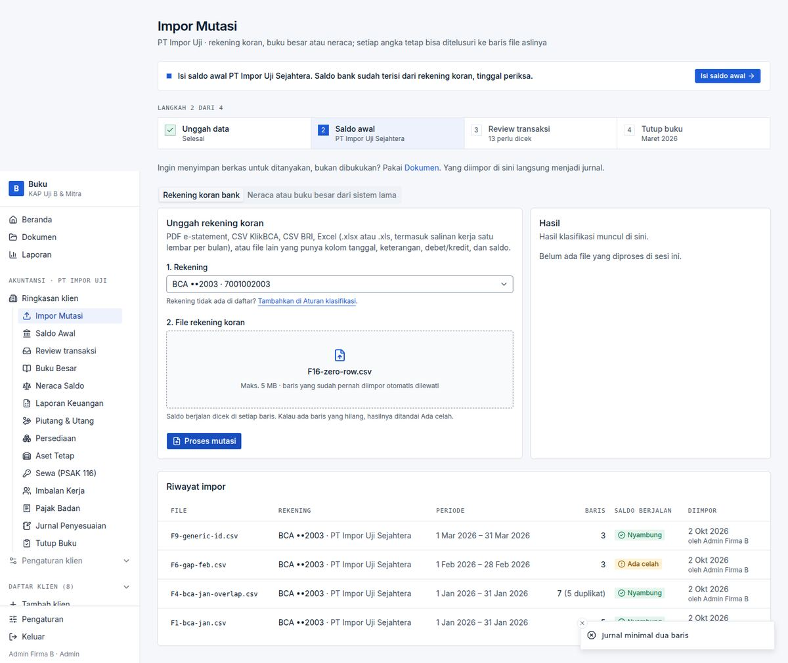 |
| [BUG-010](./bugs/BUG-010.md) | Low | 20-digit amounts → "Terjadi kesalahan tak terduga" | 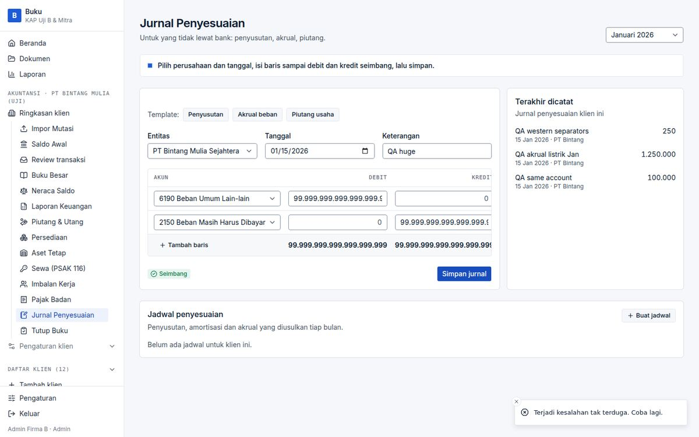 |
| [BUG-011](./bugs/BUG-011.md) | Low | NPWP accepts 19–25 digits | 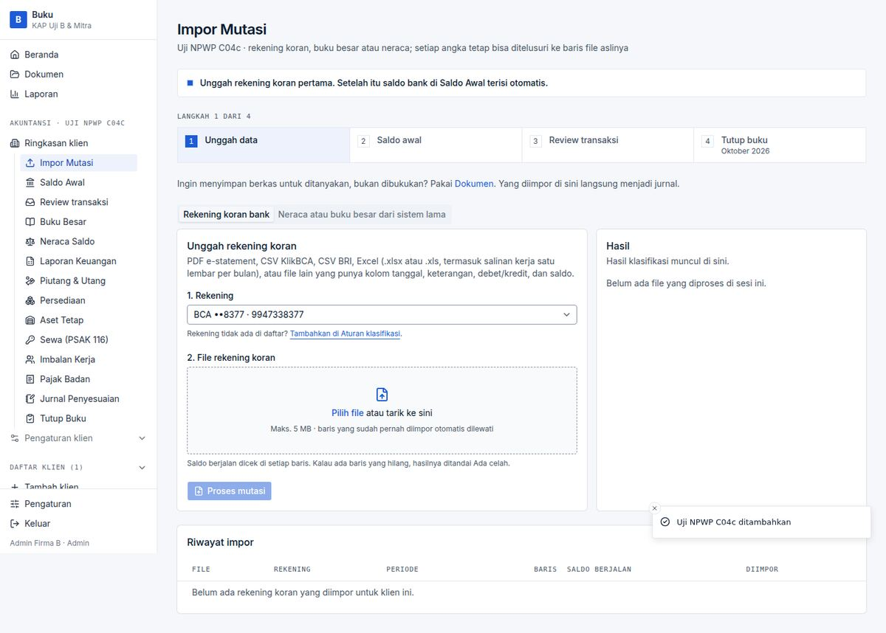 |
| [BUG-012](./bugs/BUG-012.md) | Low | Impor page overflows on mobile |  |
| [BUG-013](./bugs/BUG-013.md) | Low | Same `<title>` on every page | — |
| [BUG-014](./bugs/BUG-014.md) | Low | Long text overflows; "Sewa Sewa" in a toast | 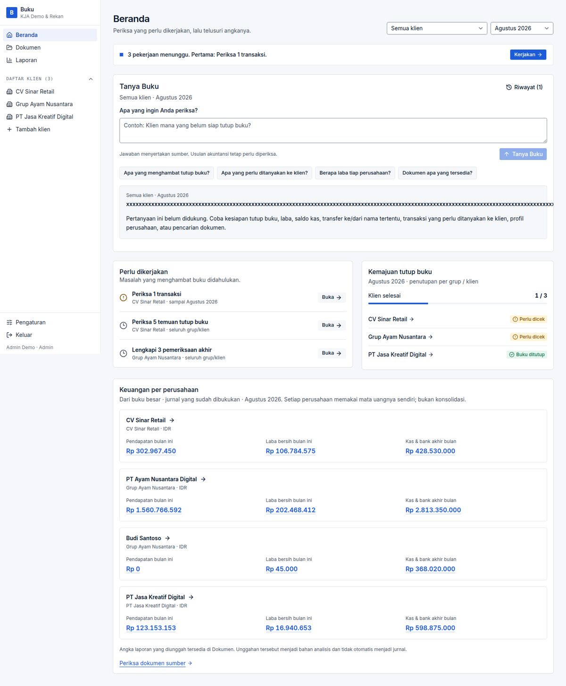 |

## 6. Observations to decide on (not bugs)

- **Defence in depth.** The database enforces only per-line CHECKs (non-negative, one side). Balanced entries, period lock and immutability live only in `postJournal` (no triggers/RLS — confirmed: `pg_trigger` empty). Anything writing SQL directly can unbalance the books or edit locked months.
- **AI key is global** (`AppSetting` has no firm id): a second firm's admin sees the first firm's key tail and can overwrite it (`S3`). Harmless under ADR 0008 (one workspace per deployment), a leak if a second firm is ever provisioned.
- **Staging Supabase advisor:** *Leaked password protection disabled* (WARN). No exposed-table findings.
- **Manual journal accepts the same account on both sides** (zero-effect entry) (`K6`); **US-style dates** (`MM/DD`) are silently read as `DD/MM` (`E17`); **Excel export is static values** with no formulas (`X6`) and shows year-to-date only (screen shows month + YTD).
- **Concurrency:** two sessions accepting the same review line at once produced exactly one entry (`Z1`) — the race hypothesised from reading the code did **not** reproduce in one attempt (not proof of absence; the lock-vs-post window in `lockPeriod` was not stress-tested).
- **Regulatory content worth a tax-advisor review** (from code reading, *not* executed, regulations not re-verified here): PPh 21 prefill is 5 % and there is no TER/PTKP logic; PPh 26 and Pasal 15 are not supported; KJS codes 411122/411123/411127/411212 missing; employee-benefit default retirement age 56 vs the pension age that has been rising (59 in 2025); deferred tax at flat 22 %; unrealised FX not reversed as a fiscal correction; PP 55 eligibility is left to the accountant (the app says so); the code cites "PMK 72/2023" for depreciation groups — the group table matches Pasal 11 UU PPh but I could not verify that citation.

## 7. Not covered

Real Supabase Auth (invite/reset e-mail, token refresh) · real AI behaviour · Google Drive OAuth · scanned/real/password PDFs and SMBC multi-currency PDFs (only the repo's own tests) · production · load testing · non-Chromium browsers · benefits (PSAK 24) and documents workspace beyond the repo's own e2e specs (both pass) · stress testing of the lock/post race.

## 8. Reproducing

`bash scripts/session-start.sh` → `npm run build` → run a local Auth endpoint or point `.env` at the staging project → drive the scenarios in [test-plan.md](./test-plan.md). The generated edge-case files, the local-Auth stand-in and the Playwright scripts were kept outside the repo; ask if you want them added under `e2e/` as permanent regression specs for the open bugs.
